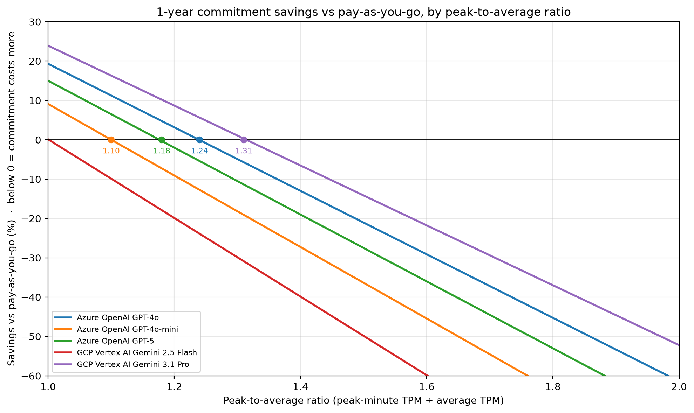

# llm-cost-lab

**A hands-on lab for modeling and governing the cost of LLM and AI infrastructure.**


---

## Why this exists

As organizations move real workloads onto large language models and AI infrastructure, a new cost-management problem is emerging: **AI compute is expensive, its pricing is opaque, and the tools built for traditional cloud spend don't map cleanly onto it.** Commitment models differ from provider to provider, pricing units are unintuitive, and cost can spike without anyone noticing until the invoice arrives.

`llm-cost-lab` is where I work through those problems in code — building the pricing models, break-even analyses, and anomaly-detection logic a FinOps practitioner needs to bring AI spend under control. It's a working lab, not a polished product: the point is to reason about AI cost governance concretely, with real data and real math, rather than in the abstract.

## What it demonstrates

For anyone reviewing this as a work sample, the project shows:

- **Fluency in LLM/AI pricing models** across providers — Azure OpenAI PTUs (hourly vs. 1-month/1-year reservations), GCP's GSUs (1-week to 1-year terms), and pay-as-you-go token pricing across Azure, AWS Bedrock, and GCP — including how each provider's capacity units "burn down" faster for output tokens than input tokens, which changes the break-even math.
- **Commitment planning** — when a committed-capacity model beats on-demand, and the sustained utilization where that flips. For most terms modeled here it is close to saturation.
- **Cost anomaly detection** — identifying unexpected spend patterns in usage data before they become billing surprises.
- **Practical data engineering** — Python and SQL against a SQLite store, structured so pricing data loads cleanly and analyses are reproducible.

In short: the FinOps discipline I've practiced on traditional cloud spend for years, applied to the AI-era cost problems that are just now taking shape.

## The problem, in plain terms

Three things make AI cost hard to govern, and each maps to a piece of this lab:

1. **Opaque units.** A "PTU," a "model unit," and a "GSU" are not intuitive, one output token can consume the capacity of 4–9 input tokens, and you can't manage what you can't translate into dollars. → *Pricing foundation.*
2. **Commitment vs. on-demand.** Providers offer discounts for committing to capacity, but committing to the wrong amount wastes money in the other direction. Knowing the break-even point requires modeling, not guessing. → *Break-even analysis.*
3. **Silent spikes.** AI usage is bursty, and cost anomalies hide easily in normal-looking data. → *Anomaly detection.*

## Modules

| Module | What it does | Status |
|---|---|---|
| **00 · Price refresh** | `data/price_catalog.json` is the pricing source of truth; `src/00_refresh_prices.py` regenerates `data/seed_pricing.sql` from it and checks that each commitment price is still published on the provider's page | ✅ Complete |
| **01 · Pricing foundation** | Loads on-demand prices, commitment terms, and per-model unit capacity into SQLite (`src/01_load_pricing.py`); SQL queries to compare unit economics across providers | ✅ Complete |
| **02 · Break-even analysis** | `src/02_breakeven.py` — models Azure PTU and GCP GSU commitments vs. pay-as-you-go across terms, with burndown-adjusted capacity, and shows how much traffic peakiness (peak-to-average ratio) a commitment can tolerate before it stops paying off | ✅ Complete |
| **03 · Cost anomaly detection** | `src/03_anomaly.py` — prices a 90-day usage series and flags spend spikes against a trailing robust baseline | ✅ Complete |

## How the math works

**Break-even (Module 02)**

- Workload mix is 75% input / 25% output tokens. One parameter drives both the pay-as-you-go blend and the capacity math.
- Monthly committed bill for one unit = `hourly_rate × 730`.
- Break-even tokens = that bill ÷ blended $/token.
- **Capacity is published in burndown tokens, not raw tokens.** Providers quote a unit's throughput in input-equivalent tokens per minute, and each output token burns several of them (Azure GPT-4o 4×, Gemini 3.1 Pro 6×, Gemini 2.5 Flash 9×). Real-token capacity for a mix with output share *s* is `burndown_tpm ÷ ((1 − s) + s × output_burn)`, times 60 × 730 for a month.
- Break-even utilization = break-even tokens ÷ real-token capacity. Over 100% means one unit hits its ceiling before it can beat pay-as-you-go.
- Burn multipliers track each model's output/input price ratio, so break-even utilization is nearly independent of the mix. The script flags any row where the two diverge by more than 15% (`burn_matches_price`), which usually means a data-entry error.
- **Peakiness matters because a commitment must be sized for the peak.** With peak-to-average ratio *P* (peak-minute TPM ÷ average TPM), a unit sized to be fully busy at peak averages `1 ÷ P` utilization. So commitment cost ÷ pay-as-you-go cost = `P × break-even utilization`, and the highest *P* a commitment can tolerate is `1 ÷ break-even utilization` (`max_peak_to_avg`).

**Key results** (one unit, 75/25 mix):

| Unit · model | Break-even util., 1-month | Break-even util., 1-year | Max peak-to-avg, 1-year | One-unit capacity (M tokens/mo) |
|---|---|---|---|---|
| Azure PTU · GPT-4o | 95% | 81% | 1.24 | 62.6 |
| Azure PTU · GPT-5 | ≈100% | 85% | 1.18 | 75.7 |
| Azure PTU · GPT-4o-mini | 107% | 91% | 1.10 | 926.1 |
| GCP GSU · Gemini 2.5 Flash | 135% | ≈100% | 1.00 | 2,356.4 |
| GCP GSU · Gemini 3.1 Pro | 103% | 76% | 1.31 | 584.0 |

Utilization cells are the share of the unit's real-token capacity you must sustain before the commitment beats pay-as-you-go; over 100% means it never pays on a single unit. Shorter terms (hourly, 1-week) are worse in every case. Full tables: `outputs/breakeven_table.csv` and `outputs/peak_sensitivity.csv`.



A 1-year commitment only beats pay-as-you-go while peak-minute traffic stays within roughly 10–30% of the average. Past that it costs more: at a peak-to-average ratio of 2, every 1-year term modeled costs 52–100% more than staying on demand. Measure your own ratio before committing; steady, high-volume workloads are the ones that qualify.

**Anomaly detection (Module 03)**

- Daily spend is priced from the on-demand table.
- Baseline is a trailing 14-day median; scale is the MAD.
- A day flags if (robust z ≥ 3.5 **and** spend ≥ 1.75× baseline) **or** spend ≥ 2.5× baseline.
- Two incidents are planted on purpose so the output is inspectable: a GPT-4o agent-loop spike and a GPT-4o-mini eval job left running.

**Where the data comes from**

Pricing is a dated lab snapshot, not a live feed. `data/price_catalog.json` is the source of truth. `src/00_refresh_prices.py` regenerates `data/seed_pricing.sql` from it (never hand-edit the seed) and fails loudly if a commitment price figure disappears from the provider's page. Throughput and burn figures come from provider documentation and are not machine-checked; each row carries its `source_url`.

## Known limitations

- Text tokens on the ≤200k-context tier only. Prompt caching, batch discounts, long-context pricing, and non-text modalities are not modeled.
- The peak-to-average analysis sizes a (fractional) unit count to the peak with no overflow to pay-as-you-go. A hybrid — commit to the base load and spill the rest — is the natural refinement and is not modeled. Whole-unit rounding and provider minimum deployment sizes are also ignored.
- The peak-to-average ratio is an input, not measured: the synthetic usage in Module 03 is daily, so it can't show intra-day peaks.
- Azure and GCP commitments are modeled. AWS Bedrock is covered for pay-as-you-go pricing only; Provisioned Throughput is not yet seeded.
- Gemini 3.1 Pro is a preview model, so its capacity figures may change.
- Module 03 runs on synthetic usage data with two planted incidents. It demonstrates the method, not production detection accuracy.

## Tech stack

- **Python** (`pandas`, `numpy`) — data loading, modeling, and analysis
- **SQL / SQLite** — pricing data store and analytical queries
- **matplotlib** — break-even and cost visualizations

## Quickstart

```bash
# 1. Clone and enter the repo
git clone https://github.com/tsweetz99/llm-cost-lab.git
cd llm-cost-lab

# 2. (Optional) create a virtual environment
python -m venv .venv && source .venv/bin/activate

# 3. Install dependencies
pip install -r requirements.txt          # SQLite ships with Python

# 4. (Optional) regenerate the seed from the price catalog
python src/00_refresh_prices.py          # add --offline to skip the live page checks

# 5. Build the pricing database (Module 01; rebuilt from scratch on every run)
python src/01_load_pricing.py

# 6. Compare unit economics
python src/queries.py

# 7. Break-even: PTU/GSU commitments vs PAYG (Module 02)
python src/02_breakeven.py

# 8. Flag spend spikes (Module 03)
python src/03_anomaly.py
```

Charts and tables land in `outputs/`.

## How this was built

This lab is deliberately built with an **AI-assisted, human-owned** workflow: I use an AI assistant for design discussion and peer-style code review, but I write and run the code myself and own every architecture and modeling decision. That's intentional — governing AI-generated work with a human in the loop is exactly the discipline I advocate for on the cost-governance side, so the project practices what it preaches.

## About

I'm a FinOps and cloud cost-optimization practitioner focused on the emerging discipline of **AI cost governance** — bringing the accountability, commitment planning, and anomaly detection that matured on traditional cloud spend to LLM and AI infrastructure.

🔗 [linkedin.com/in/tsweetz](https://www.linkedin.com/in/tsweetz)
